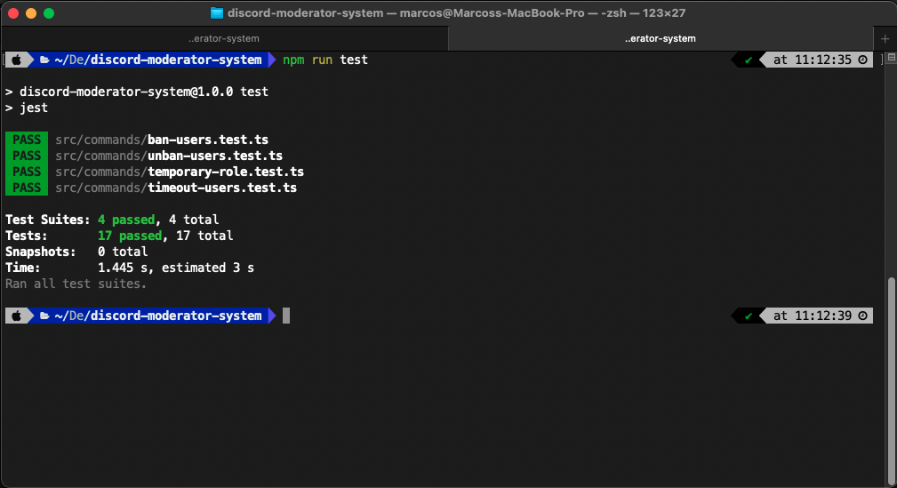

# Discord Moderator System

This project aims to help discord staff roles in making the discord channels moderation using custom slash commands and discord API.

**Some commands Examples**

| Command           | Description                                                |
|-------------------|------------------------------------------------------------|
|```/ban-users```       | This command is used to ban users that break any rule of <br> the channel   |
|```/unban-users```     | This command makes the unban of the user back to the channel <br> I've created to make more easier during the tests phase |
|```/user-timeout```    | This command set a kind of punishment to user that take some <br> wrong action but no so harmful thar deserves a ban. This punishment is automatically removed <br> after some amount of time |
|```/temporary-role```  | This command adds a new role to the user for a some amount of time <br> after that this role is removed from user |

## Bot Role

The server has a bot that informs the user running the slash command about the status of this command. And there are channels for logging about every command executed inside the server. Whenever a staff member executes some slash command against another user, this command as well as the user being affected by this command will be logged in their respective channel.

> :memo: **Note:** The systems will perform some checks in every command typed to ensure certain rules, as well:

* Does the user have the necessary permissions to run this command? <br>
* Does the user against the command that is being executed exist in the current server? <br>
* The user running the command and the user receiving the command cannot have the same level of roles. <br>
* The user running the command cannot run it against the channel bot. <br>
* The user running the command, cannot execute it against himself. <br>

## Tech stack used in this project

In this project was used:

* NodeJS;
* Typescript;
* DiscordJS;
* Jest;
* Nodemon;
* PrettyMs;

## How to run

After make the clone of this repo, run: <br>
```sh
npm install
```
to install all dependencies required for the project.

For run the project after install all needed dependencies run:

```sh
npm run dev
```
> :warning: **Warning** For the correct working of this project, you must provide your discord required bot credentials at 
```.env.example``` file, rewriting it to ```.env```

## How to run the project's unit tests?

The project has unit tests to ensure the quality and security of the code. To run it execute the command: <br>

```sh
npm run test
```
you should be able to see the tests result like this:

<p align="center">
  
</p>